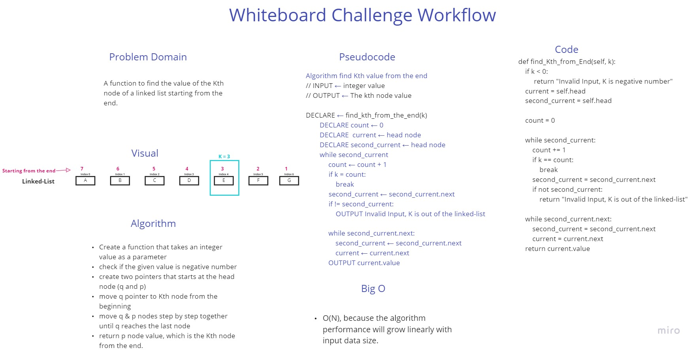

# Singly Linked List
A class which create the linked list data structure with (insert and push) methods

## Challenge
- Challenge 05
- Challenge 06
- Challenge 07

### Challenge 07 Whiteboard process

## Approach & Efficiency
- Big O : O(N) because of the iteration process in the search method

## API
- insert method:
    - this function to insert a new node at the beginning of the linked list
- search method:
    - this function to search the linked list for a specific value
- str method:
    - to print the linked list in a specific form
- find kth from the end:
    - finding the Kth element from the end.