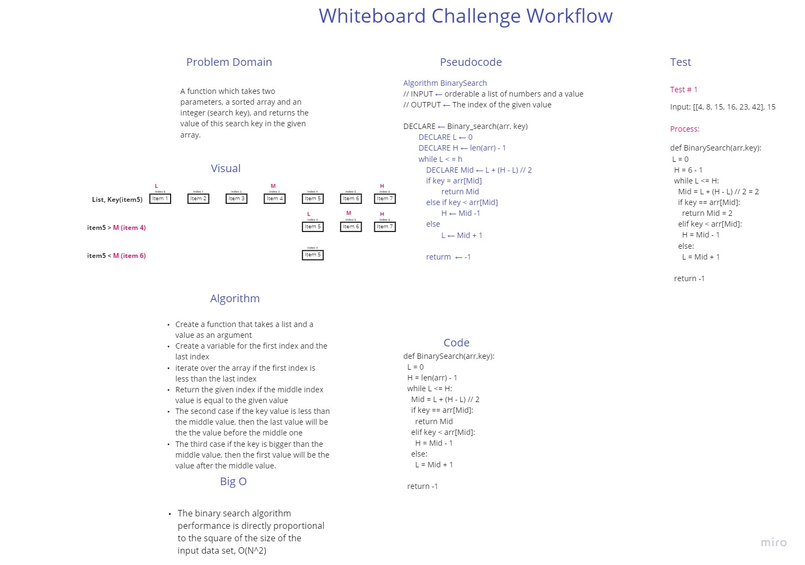

# Binary Search of Sorted Array
A function which takes two parameters, a sorted array and an integer (search key), and returns the value of this search key in the given array.

## Whiteboard Process

## Approach & Efficiency

### Approach:

- Create a function that takes a list and a value as an argument
- Create a variable for the first index and the last index
- iterate over the array if the first index is less than the last index
- Return the given index if the middle index value is equal to the given value
- The second case if the key value is less than the middle value, then the last value will be the the value before the middle one
- The third case if the key is bigger than the middle value, then the first value will be the value after the middle value.

