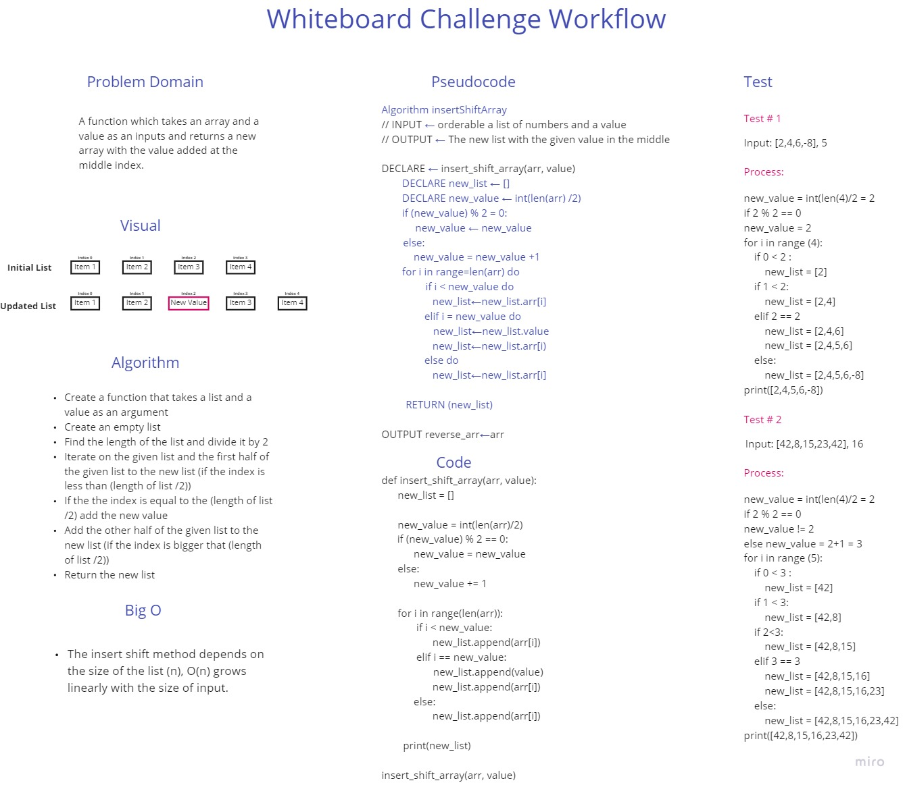

# Insert to Middle of an Array
A function which takes an array and a value as an inputs and returns a new array with the value added at the middle index.

## Whiteboard Process

## Approach & Efficiency

### Approach:

- Create a function that takes a list and a value as an argument
- Create an empty list
- Find the length of the list and divide it by 2
- Iterate on the given list and the first half of the given list to the new list (if the index is less than (length of list /2))
- If the the index is equal to the (length of list /2) add the new value
- Add the other half of the given list to the new list (if the index is bigger that (length of list /2))
- Return the new list