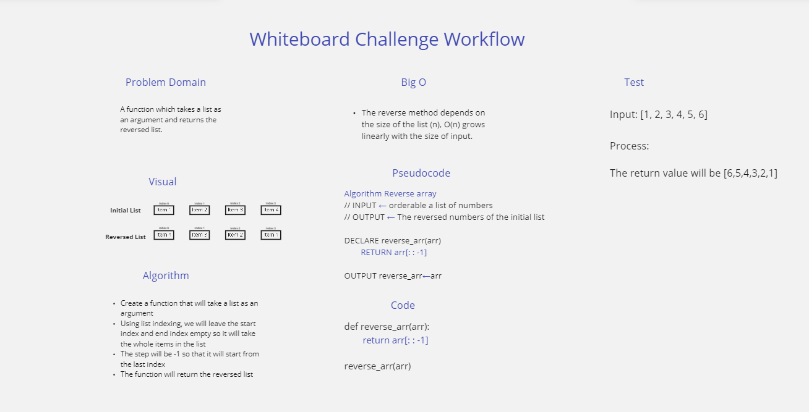

# Reverse an Array

A function which takes a list as an argument and returns the reversed list.

## Whiteboard Process

## Approach & Efficiency

### Approach:
- Create a function that will take a list as an argument
- Using list indexing, we will leave the start index and end index empty so it will take the whole items in the list
- The step will be -1 so that it will start from the last index 
- The function will return the reversed list